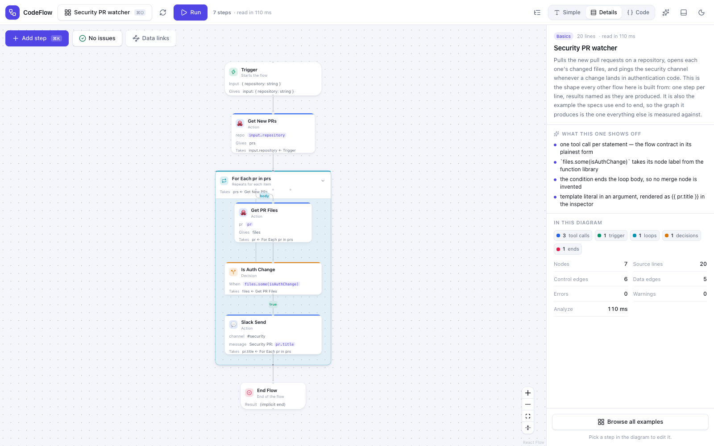
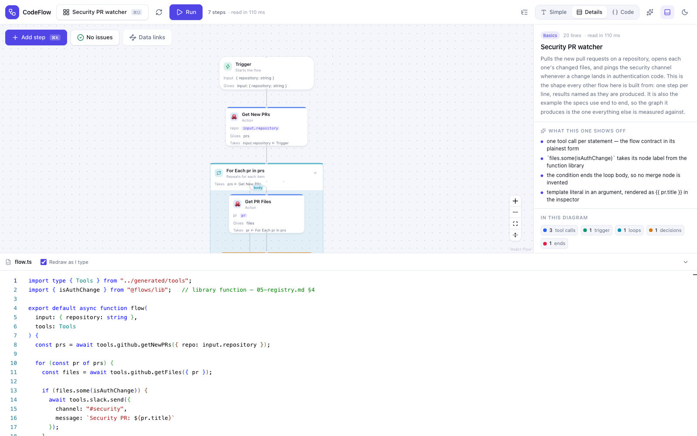
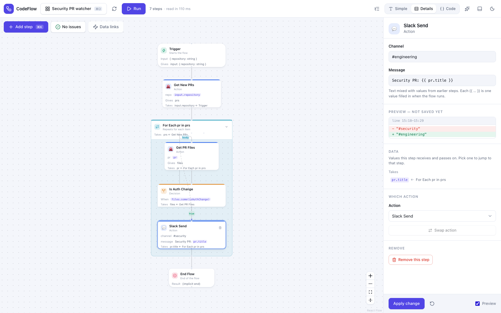
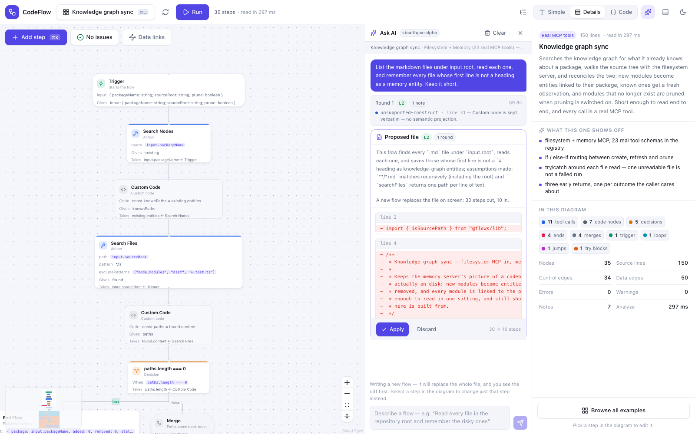
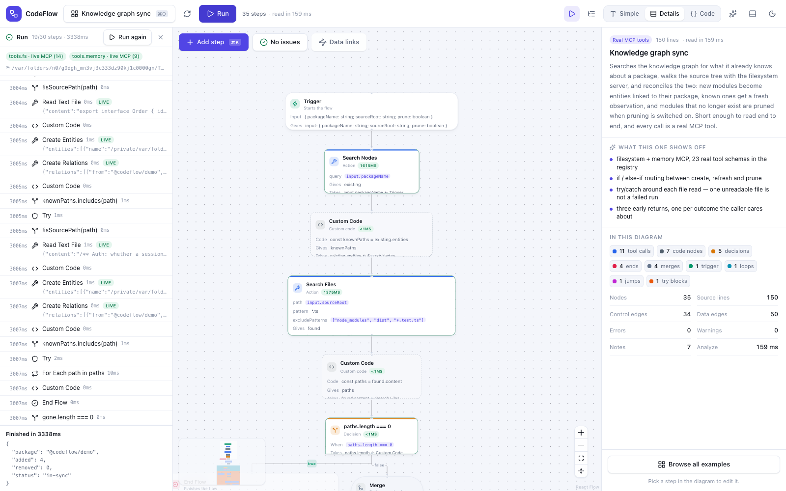
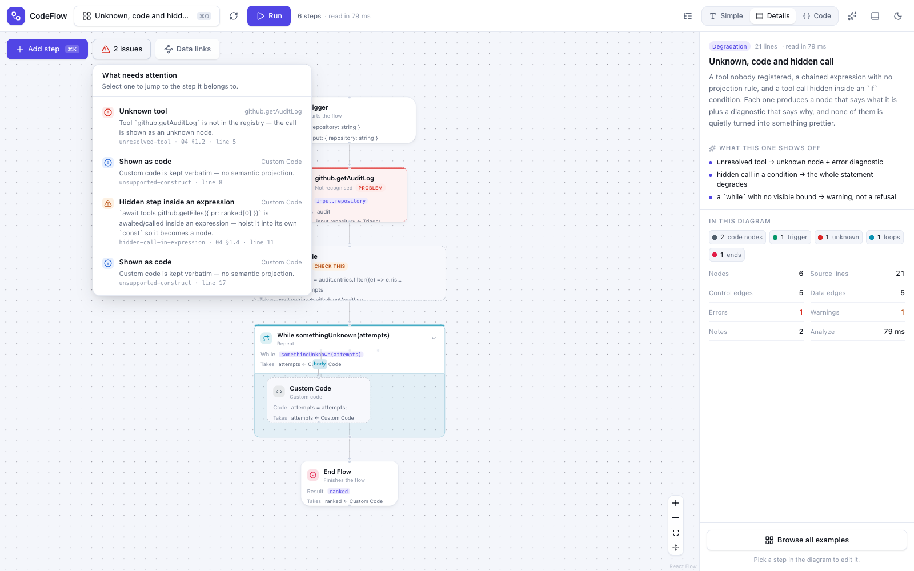
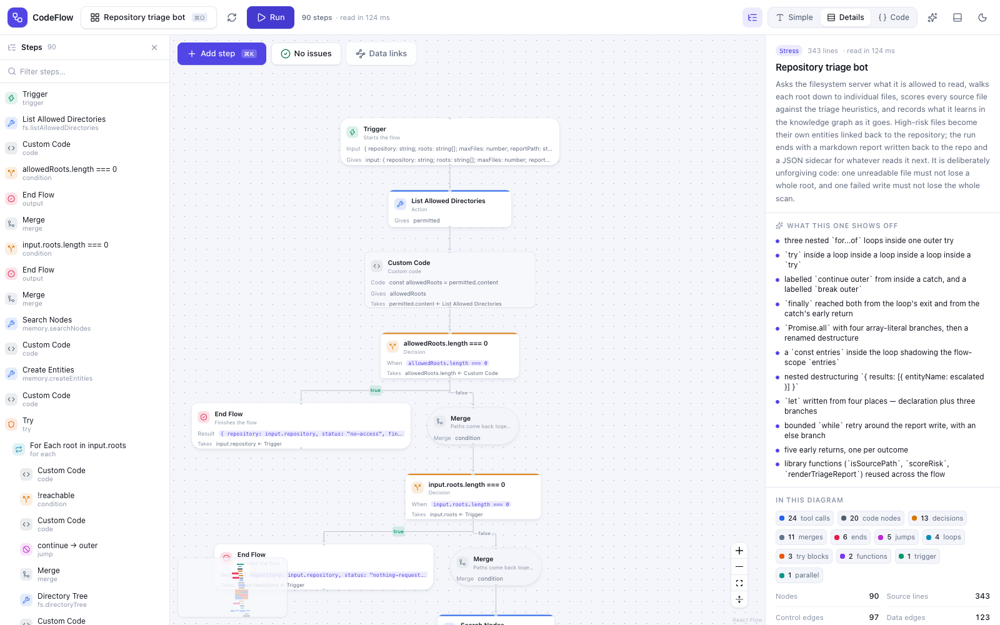
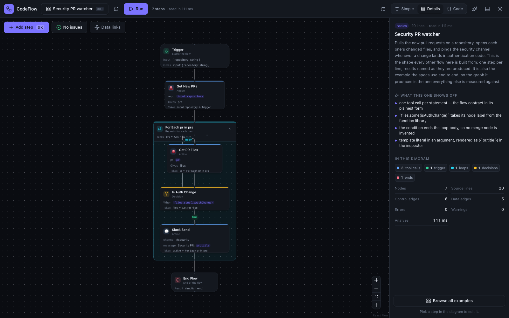
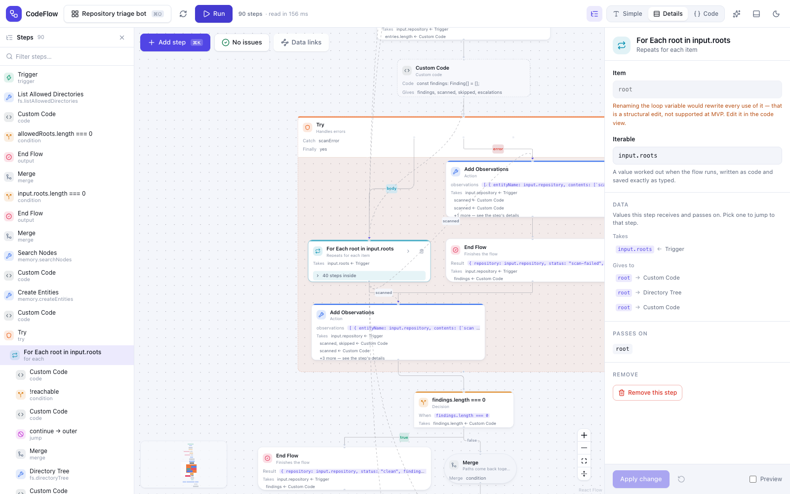

# CodeFlow

**AI is very good at writing TypeScript that calls your tools. The people who have to live with that automation cannot read TypeScript.** CodeFlow closes that gap: it reads a flow file and projects it into an editable workflow diagram, and when someone changes a field on the diagram it writes a minimal patch back into the file — the code stays the one and only source of truth, and the picture is computed from it the way a minimap is computed from text.



*The canonical example: twenty lines of TypeScript, seven steps. Nothing was configured to produce this diagram — it is read out of the file, every time the file changes.*

---

## Why not just use a workflow builder?

n8n, Zapier and friends make the **graph** the truth and generate code from it. That buys you a picture, and it costs you the language: your automation can only ever express what the vendor's node set can express, and the moment you need something the nodes cannot say you are writing a "Code" node that the graph no longer understands. CodeFlow inverts it — real TypeScript underneath, the diagram derived from it — so the escape hatch is the language itself. Anything CodeFlow cannot project becomes a **custom code node** that keeps its source verbatim and says so; it never guesses, and it never quietly turns your code into something prettier than it is.

---

## Quick start

The packages are prepared to publish as `@codeflow-team/core`, `@codeflow-team/react`, `@codeflow-team/cli`, `@codeflow-team/mcp` and `@codeflow-team/examples` (v0.1.0, AGPL-3.0-or-later). Until that first release lands, work in the repository:

```bash
pnpm install
pnpm build          # 6 packages
pnpm test           # 1,640 tests
pnpm dev            # the demo at http://localhost:5173
```

Requires Node 20+ (the CLI needs 22.18+ or 23.6+, where Node strips TypeScript types from `codeflow.config.ts` without a flag) and pnpm 9.

Analyzing a flow takes three calls — a registry of the tools that exist, a session, and `analyze`:

```js
import { createCodeFlow, createRegistry } from "@codeflow-team/core";
import { EXAMPLES, registryFor } from "@codeflow-team/examples";

// Any flow file works; the examples package ships thirteen of them.
const example = EXAMPLES.find((e) => e.id === "canonical");
const { tools, functions } = registryFor(example);

// A session owns the registry the flow is analyzed against.
const session = createCodeFlow({ registry: createRegistry({ tools, functions }) });
const graph = await session.analyze(example.source, { file: "canonical.flow.ts" });

for (const node of graph.nodes) {
  console.log(`${node.type.padEnd(10)} ${node.label}`);
}
console.log(`${graph.nodes.length} nodes, ${graph.edges.length} edges`);
```

```text
trigger    Trigger
tool       Get New PRs
loop       For Each pr in prs
tool       Get PR Files
condition  Is Auth Change
tool       Slack Send
output     End Flow
7 nodes, 11 edges
```

---

## What it does

### Code becomes a diagram

The graph is derived, not stored. Tool calls, conditions, loops, `try`/`catch`/`finally`, `Promise.all`, labelled `break`/`continue` and early returns each have a projection rule; everything else is kept verbatim as a code node.



### An edit becomes a one-line patch

Change a field in the inspector and CodeFlow shows you the exact source range it will rewrite before you commit. Nothing is regenerated: comments, formatting and the sibling call three lines down are untouched, byte for byte.



The same edit through the library:

```js
const slack = graph.nodes.find((n) => n.data.toolName === "slack.send");
const { patches } = await session.patchNode(slack.id, { channel: "#engineering" });
console.dir(patches, { depth: null });
```

```text
[
  {
    range: {
      start: { line: 15, column: 18, offset: 462 },
      end: { line: 15, column: 29, offset: 473 }
    },
    oldText: '"#security"',
    newText: '"#engineering"'
  }
]
```

That is the MVP's official acceptance criterion, and it is a fixture in the test suite (`packages/core/test/fixtures/02-two-identical-siblings/edits/acceptance-08-4.edit.json`): change the channel on one of two byte-identical sibling calls, and exactly one line moves, the sibling is untouched, every node keeps its id, and the round trip is idempotent.

### AI writes or edits the flow, and you see the diff first

The demo's chat panel sends the registry, the flow-style guide and your request to a model, scores the answer against the conformance ladder (L0 parses and honours the contract, L1 every name resolves, L2 projects to a clean graph), and shows the level, the diagnostics and the diff **before** anything is applied. Node-level edits go through the same patch engine as a manual edit, so they stay minimal.



### Run it, against real MCP servers

The demo ships a runner that executes the flow in a Node worker wired to real MCP servers over stdio — filesystem, memory, everything, sequential-thinking. Steps light up as they start, each tool call is stamped `LIVE` with its latency and its real response, and the run log ends with the value the flow returned.



### It never lies to you about what it understood

An unregistered tool becomes an *unknown* node with an error, not a plausible-looking action. An expression with no projection rule becomes a code node that says "kept verbatim — no semantic projection". A tool call hidden inside an `if` condition degrades the whole statement and tells you how to hoist it.



### Large flows stay readable

A 343-line flow is 90 steps. The canvas folds containers by default above 40 steps, keeps a floor on auto-fit zoom so text never shrinks below reading size, and gives you a step list to jump with. Data edges are off until you select a step, which removes about 60% of the lines on screen.



Dark theme is a first-class palette, not an inverted filter:



---

## Packages

| Package | What it is for |
|---|---|
| [`@codeflow-team/core`](packages/core/README.md) | The library. Registry, typed-API codegen, analyzer, stable node identity, graph diff, minimal patch engine, AI generation context and the L0/L1/L2 validator. Browser-safe: nothing in it imports a Node API. |
| [`@codeflow-team/react`](packages/react/README.md) | The UI. React Flow canvas with hierarchical ELK layout, inspector, Monaco panel with two-way selection sync, diff preview, diagnostics, three disclosure levels, light and dark. |
| [`@codeflow-team/cli`](packages/cli/README.md) | The Node half. `codeflow init` / `generate` / `check`, and the file-based function library over `lib/`. |
| [`@codeflow-team/mcp`](packages/mcp/README.md) | Optional adapter. MCP `tools/list` → `ToolDefinition`, with safe name slugging and cursor paging. Zero runtime dependencies; the MCP SDK is an optional peer. |
| [`@codeflow-team/examples`](packages/examples/README.md) | Thirteen flows and the registries they are written against, plus twelve everyday library functions — 65 tool schemas captured from 8 real MCP servers. The stress corpus and the demo gallery in one package. |
| [`apps/demo`](apps/demo/README.md) | The demo app: gallery, canvas, inspector, AI chat, and the MCP-backed runner. |

---

## Real numbers

Every number here comes from something in this repository that you can re-run.

**Speed.** The largest example is 345 lines → 101 nodes, 114 control edges, 172 data edges. Cold analysis of it takes **21 ms** (fastest of five samples; median 22 ms) against the 500 ms budget the specs set, and a warm re-analysis after an edit takes **26 ms** against a 100 ms budget. Reproduce with `pnpm --filter @codeflow-team/core exec vitest run test/stress/performance.test.ts`, which prints the whole table.

**Tests.** `pnpm test` runs **1,640 passing tests** across 68 files — core 1,185, react 155, mcp 155, cli 63, examples 30, demo 52 — plus 3 skipped (they need a live AI key) and 10 `it.todo` that mark known gaps rather than hiding them. 206 of those cases are adversarial hardening cases, and they exist because they each caught a real bug: a brace-less `if` body whose deletion silently swallowed the next statement, a quoted key that let a patch append a second `channel` property, a BOM that shifted every offset by one character.

**Real MCP schemas find bugs mocks do not.** Feeding 65 live schemas from 8 servers through codegen broke the build twice: Anthropic's own filesystem server has `'**/*.ext'` in a description, which closes a JSDoc comment early and produced 379 TypeScript errors; and every zod-based server emits `$ref`, which generated a type nobody declared.

**AI conformance, honestly.** On small flows the model reached **L2 on 12 of 12** generations. Scaled up to 150–400-line briefs across 47 calls and 11,597 generated lines, L0 and L1 stayed at **100%** — not one invented tool, not one broken contract, even against a 38-tool registry — but **L2 collapsed to 0 of 14**. One idiom did it (`failures.push({...})`, which hides a step rather than a tool call); one added style rule took it back to 7 of 7 on the first attempt.

**And L2 is not the same as "it runs."** A later eval generated flows and then *executed* them against four real MCP servers, checking the files and memory entities afterwards rather than trusting the transcript. Every generation reached L2. Only half delivered on the first attempt. After correcting for the cases where the harness demanded more than its own brief did, **3 of 20 runs (15%) produced a flow that looked right and did not do the job** — roughly one in six. Feeding the runtime error back fixed 6 of 7. The full write-up, with the raw JSON of every run, is in [`packages/core/test/ai/results/generate-and-run-analysis.md`](packages/core/test/ai/results/generate-and-run-analysis.md).

That last number is the reason this project shows you a diagram at all. A static score cannot tell you whether an automation does its job; a person looking at the picture often can.

---

## Status and limits

This is a complete MVP, not a 1.0. It is built against the specs in [`docs/`](docs/README.md) and matches them.

**Deliberately not supported:**

- **Structural editing.** You can change fields, conditions, iterables, tools and code regions, insert a step and delete a step. You cannot rewire edges, rename a loop variable or restructure control flow from the diagram — those are rewrites, not patches, and the UI says so instead of approximating.

  

- **Execution in core.** The library analyzes and patches; it does not run anything. Core has no execution engine and no dependency on one.
- **Arbitrary application code.** The input is flow code that follows a contract ([`docs/01-flow-contract.md`](docs/01-flow-contract.md)). That restriction is what makes the projection tractable.

**Where the edges still are, stated plainly:** every edit is AST-anchored — insert and delete resolve a real syntax node and use line arithmetic only to place text at a boundary the AST chose. Insert refuses the two shapes where "the line after the anchor" is not "after the anchor's step": a statement that *is* the whole brace-less body of an `if`/loop (inserting there would put the new step outside the branch it was aimed at), and anything after a `break`/`continue`/`return` (nothing runs there). Both are refusals with a reason, because both used to be silent.

What remains unsupported is structural relocation: moving a step into or out of a branch, and wrapping or unwrapping one, are rewrites rather than patches. One conservative edge is left over — appending into an `if` branch falls back to the enclosing container's scope, so it can refuse a reference to something that branch declares.

**The demo runner is a demo runner, not a sandbox.** It starts a short allowlist of MCP servers that are harmless on a laptop, points the filesystem server at a scratch directory it deletes afterwards, and gives the worker no network of its own. That is enough to prove a flow really runs; it is not isolation. A real deployment needs a V8 isolate or a container.

---

## More

- **Design docs** — [`docs/`](docs/README.md). Twelve documents written before the implementation: the flow contract, the analyzer rules, the data model and identity guarantees, the patch engine, the UI, the AI codegen ladder, the testing invariants. Start with [`docs/00-overview.md`](docs/00-overview.md).
- **Build journal** — [`NOTES.md`](NOTES.md) (in Vietnamese): what was decided, what broke, and what each bug hunt actually found.
- **Releasing** — [`RELEASING.md`](RELEASING.md). A release is a version bump merged to `main`; publishing runs on npm trusted publishing (OIDC), so there is no long-lived token in the repository after the first release.
- **Contributing** — there is no contribution guide yet. The house rules are visible in the test suite: every bug found becomes a permanent offline regression test, and anything the MVP cannot do is a visible refusal rather than a silent approximation.
- **License** — [GNU AGPL v3 or later](LICENSE).
